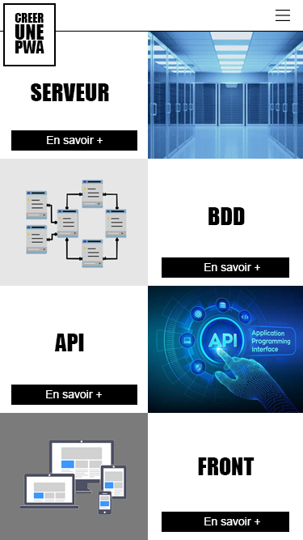
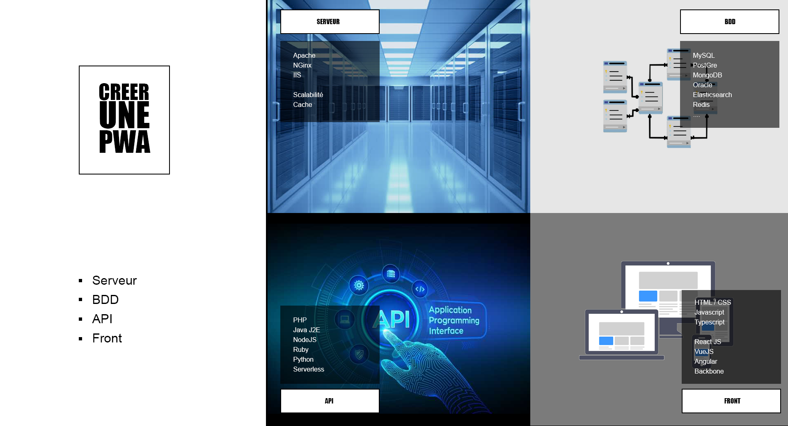
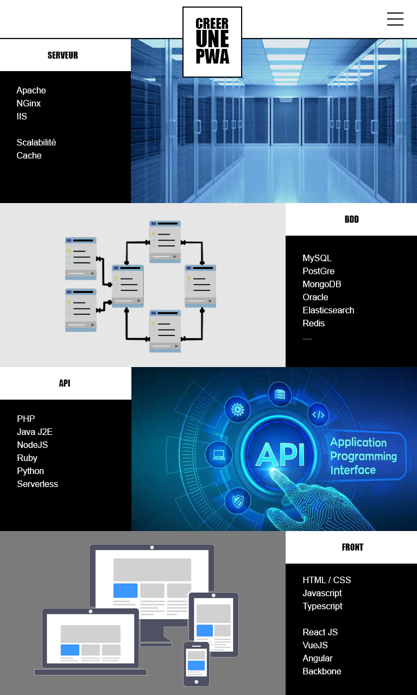
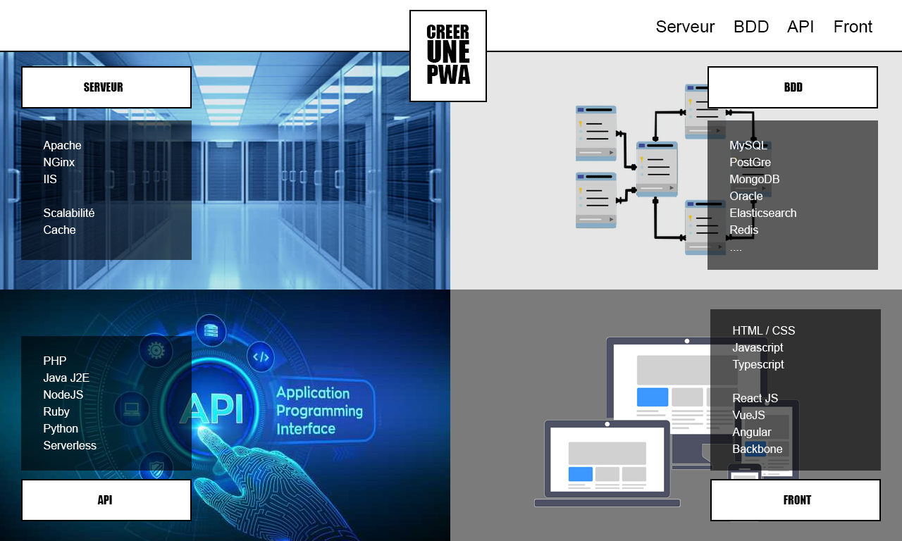

# Create a Progressive Web App

I chose to use SCSS thanks to its clear hierarchy. So I run the following command to compile SCSS into CSS :

```npm
npm run sass
```

## To Do

4 screen types :

- Smartphone = basic CSS = Mobile First :



- Dekstop = width > 1024px :



- Tablet Portrait = width device between 768 and 1024 px :



- Tablet Landscape = width device between 768 and 1024 px and landscape :



## My Work

